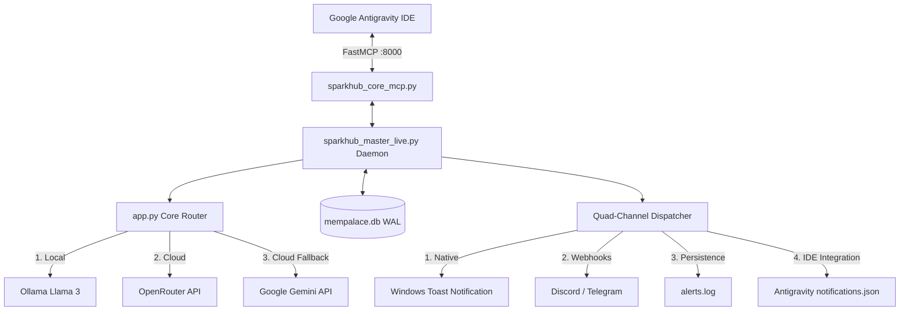

# ⚡ SparkHub v3.0 Universal & Autonomous

> **Status:** 🟢 Ativo & Permanente (FastMCP + Quad-Channel + Tríplice Cascata + Daemon Boot)  
> **Repositório GitHub Oficial:** 🌐 [https://github.com/AlxCurvelo/SparkHub-v3.0](https://github.com/AlxCurvelo/SparkHub-v3.0)  
> **SSH Remote:** `git@github.com:AlxCurvelo/SparkHub-v3.0.git`  
> **Barramento MCP:** FastMCP na porta `:8000` (configurável via `SPARKHUB_PORT`)  
> **Governança:** Domain-Driven Design, Hexagonal Architecture, Zero Mocks  
> **Túnel de Conectividade:** `https://siesta-usage-cannabis.ngrok-free.dev`  

---

## 🚀 1. Visão Geral e Filosofia

O **SparkHub v3.0** é a plataforma autônoma de automação, roteamento de inteligência artificial e acervo de memórias em tempo real para o ecossistema Windows, governada nativamente pelo **Google Antigravity IDE**.

Ele opera sob a diretriz canônica:
> *"A mente governa, a máquina trabalha."*

---

## 🏛️ 2. Arquitetura do Sistema



---

## ⚙️ 3. Principais Módulos

| Módulo | Arquivo Principal | Função |
|---|---|---|
| **Núcleo de Caminhos** | [`sparkhub_paths.py`](sparkhub_paths.py) | Resolução dinâmica de raiz e portas sem caminhos hardcoded. |
| **Orquestrador Maestro** | [`sparkhub_master_live.py`](sparkhub_master_live.py) | Daemon persistente, monitoramento de VRAM/CPU e fila anti-spam. |
| **Roteador Tríplice Cascata** | [`app.py`](app.py) | Servidor FastAPI, roteamento dinâmico Ollama ➔ OpenRouter ➔ Gemini. |
| **Servidor FastMCP** | [`sparkhub_core_mcp.py`](sparkhub_core_mcp.py) | Interface de ferramentas MCP nativa para a Antigravity IDE. |
| **MemPalace Engine** | [`mempalace_autocollect_master.py`](mempalace_autocollect_master.py) | Coleta autônoma e busca FTS5/BM25 em `mempalace.db` (WAL mode). |
| **Sincronizador Atômico** | [`sync_requisicoes_master.py`](sync_requisicoes_master.py) | Sincronização resiliente local e Google Sheets via contratos Pydantic. |
| **Quad-Channel Dispatcher** | Integrado ao Maestro | Notificação multi-canal com isolamento individual por canal. |

---

## 🛠️ 4. Catálogo de Ferramentas MCP

1. 🔍 **`find_app`**: Auto-discovery de programas e atalhos instalados no Windows.
2. 🌟 **`open_os_app`**: Abertura nativa via `os.startfile()` ou `subprocess`.
3. ⚡ **`run_command`**: Execução de scripts PowerShell/CMD em ambiente Windows.
4. 🧠 **`search_memory`**: Pesquisa textual e vetorial no acervo `mempalace.db`.
5. 🔄 **`sync_data`**: Sincronização em lote guiada por contratos Pydantic.

---

## 🚀 5. Como Executar

- **Modo Daemon Persistente (Padrão):**
  ```cmd
  python sparkhub_master_live.py
  ```

## 📝 Atualizações Recentes (Resumo)

- Extraído o Roteador Tríplice Cascata para `router_ai.py` (mantida compatibilidade com `app.route_ai_request`).
- Centralizada a inicialização e migração FTS5 em `sparkhub_db.py` para evitar duplicação.
- Implementado lockfile atômico para checkpoints de estado (`StateManager.save_checkpoint`).
- Parâmetros de ambiente adicionados para o gateway WhatsApp: `PUPPETEER_EXECUTABLE`, `WHATSAPP_QR_PATH`.
- Substituído `sys.exit` por exceções tratáveis para maior robustez nas rotinas de sincronização.

Consulte o README principal ou Docs/07_AUDIT_REPORT.md para o relatório de auditoria e detalhes das alterações.
- **Modo Teste de Carga Sintético:**
  ```cmd
  python sparkhub_master_live.py --test
  ```

- **Inicialização da Sessão Interativa + Tunelamento ngrok:**
  ```cmd
  iniciar_sparkhub.bat
  ```

- **Instalar Boot Automático no Windows Task Scheduler:**
  ```cmd
  install_daemon.bat
  ```
